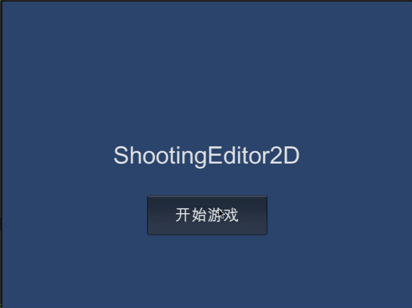

# ShootingEditor2D 

一款内置关卡编辑器的射击游戏

环境：

* Unity 2019.4LTS

地址：

* github 地址：https://github.com/liangxiegame/ShootingEditor2D
* 镜像地址：https://gitee.com/liangxiegame/ShootingEditor2D
* QFramework 地址：https://github.com/liangxiegame/QFramework

当前版本 v0.0.6

## 演示:

1. 游戏预览

2. 关卡编辑预览

